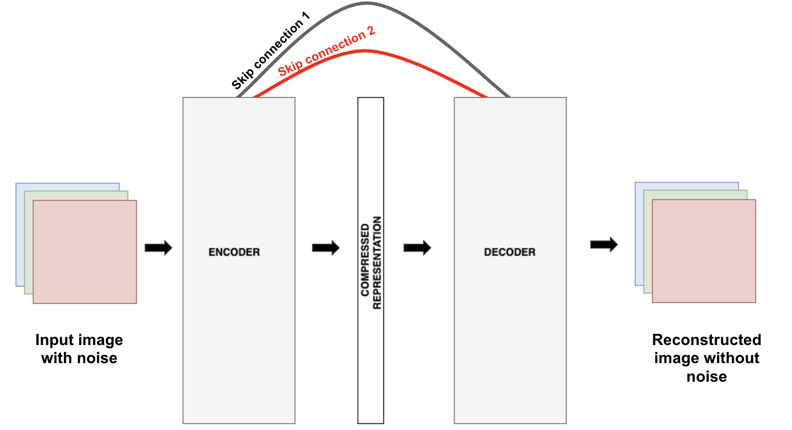
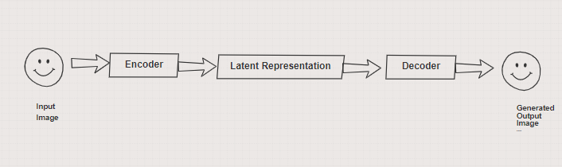
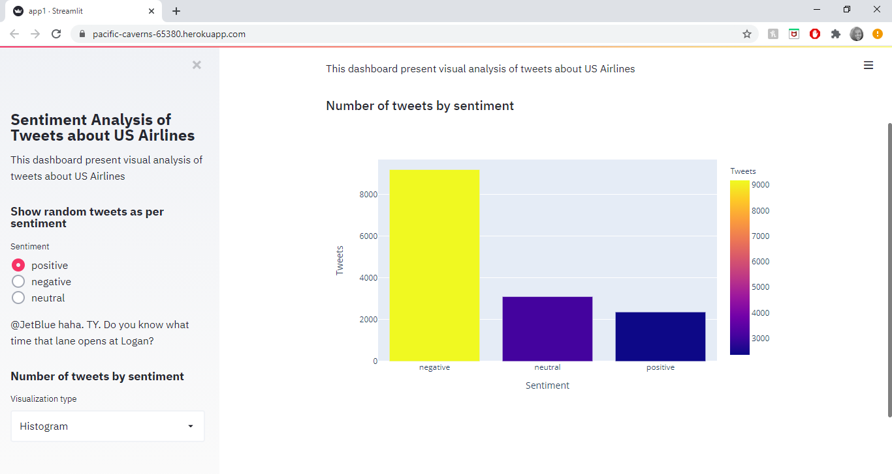

# Portfolio
---
## Deep Learning 

### Reconstructing Medical Images using Deep learning

 Medical imaging data sets are often imbalanced as pathologic findings are  generally rare, which introduce significant challenges when training deep learning models, but using deep learning can help. Deep learning is so adept at image work that some AI scientists are using neural networks to create medical images, not just read them. 

 Generative models like Autoencoder, Variational Autoencoder and GAN use patterns learned from real scans to create synthetic versions of CT or MRI images.  The data can be randomly generated and endlessly diverse, allowing researchers to access large volumes of necessary data without any concerns around patient privacy or consent.Such a strategy could significantly reduce of enough data.  In this project I have implemented autoencoder with skip connection for skin lesion image generation.

 

---

### Prdicting Emotions using Deep learning

 Deep learning application range from classify images to recreating images. In this project, I have used deep learning to predict emotions using facial features. Predicting emotions has many commercial applications like different filters for social media, customer behaviour analysis, and so on.  

 

 

---

### Variational Autoencoder Performance Analysis

This is my complete implementation of Variational Autoenocder (VAE) and the impact of hyperparameter tuning on VAE performance using MNIST and CelebA dataset

**MNIST:** The MNIST database (Modified National Institute of Standards and Technology database) is a large database of handwritten digits that is commonly used for training various image processing systems.The database is also widely used for training and testing in the field of machine learning ([GitHub](https://github.com/ShrideviReddy/Evaluating-VAE)).

**CelebA Dataset:** CelebFaces Attributes Dataset (CelebA) is a large-scale face attributes dataset with more than 200K celebrity images, each with 40 attribute annotations. The images in this dataset cover large pose variations and background clutter. ([GitHub](https://github.com/ShrideviReddy/Evaluating-VAE)).

---
### Fighting Adversarial attacks

Adversarial attacks are major threats to machine learning models. Machine learning models can be easily fooled even with simple attacks like FGSM. In this project I have implemented different research papers about adversarial attacks and defenses against them. This project also has a collection of different state of the art research papers. 

 

<!--
Photo by Clint Patterson on Unsplash
-->
 

---
## Data Science

### Breast Cancer Prediction Web App

 After processing the dataset and building a model to predict breast cancer, I built an interactive user interface with Flask and hosted the web application on Heroku server.

 

<!--
Photo by Shahadat Rahman on Unsplash
-->
 

--- 
### Web deployed dashboard

 In this project I have built a visually appealing dashboard of the US Airlines tweets dataset. The user interface was created using Streamlit and the web application is hosted on a Heroku server 

 

 

---

---
## Articles

I contribute to medium platform as blogger, by documenting my learning and project process. Making things easy for self-learners. 

 

- [Python List Basics](https://medium.com/the-innovation/python-list-basics-b271eece7ddc)
- [Power of storytelling with visual data](https://medium.com/@sreddy13/power-of-storytelling-with-visual-data-8289e193b7b6)

---

© 2020 Shridevi Reddy. Powered by Jekyll and the Minimal Theme.

